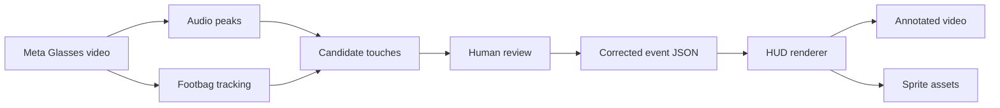

# Hacky Track

<p align="center">
  
</p>

<p align="center">
  <strong>POV footbag analytics for Meta Glasses footage.</strong><br>
  Track rallies, touches, stalls, trick labels, and sketchy little HUD overlays from first-person video.
</p>

---

## What This Is

Hacky Track is an experimental computer-vision and audio pipeline for turning first-person footbag footage into an annotated rally video.

The current demo renders a hand-drawn HUD over Meta Glasses footage with:

- live touch count
- rally timeline
- touch impact ticks near the footbag
- stall and around-the-world popups
- a move feed such as `RIGHT KICK`, `LEFT KICK`, `RIGHT STALL`, `AROUND THE WORLD`, `OUTER RIGHT`, and `OUTER LEFT`
- reusable MS Paint-style sprite assets

The goal is not just to count touches. The goal is to make the count explainable enough that a player can tell what the tracker thinks happened.

## Current Demo

The README GIF is generated from the latest HUD render:

```text
outputs/video-506_singular_display/video506_corrected_paint_hud_overlay.mp4
```

That source MP4 is intentionally ignored by Git because it is large. The lightweight README GIF lives at:

```text
assets/readme/hacky-track-demo.gif
```

For the current demo clip, the event timeline is manually corrected:

- 19 touches
- 1 right stall
- 1 around-the-world segment
- a hand-authored move feed for the top HUD

## Why It Is Hard

POV footbag tracking has a bunch of annoying edge cases:

- the bag is small, fast, and often motion-blurred
- camera motion is constant
- a foot, knee, hand, or grass patch can hide the bag
- audio spikes help, but floor bounces and footsteps can look like touches
- a rally reset is different from a kick
- a stall is different from a kick
- an around-the-world is a time window, not just one impact frame

So the MVP uses a practical workflow: detect candidates, review them, correct them, and render outputs that make mistakes obvious.

## Pipeline



## Main Scripts

| Script | Purpose |
| --- | --- |
| `hacky_mvp.py` | Original checked-event MVP: JSON, CSV, proof frames, annotated video. |
| `paint_hud.py` | Generates the reusable hand-drawn HUD sprite sheet and shared renderer helpers. |
| `render_video506_hud.py` | Current demo renderer for the corrected video-506 HUD. |
| `scan_training_data.py` | Scans raw clips into reviewable candidate touch data. |
| `train_multimodal_detector.py` | Trains/runs a weak visual/audio candidate detector. |
| `review_app.py` | Local web app for approving, rejecting, and adding touch candidates. |
| `detect_atw_overlay.py` | Experimental footbag/foot heuristic for around-the-world detection. |

## Quickstart

Install dependencies:

```bash
python3 -m venv .venv
source .venv/bin/activate
pip install -r requirements.txt
```

Install `ffmpeg` if needed:

```bash
brew install ffmpeg
```

Render the current demo HUD:

```bash
python3 render_video506_hud.py /path/to/video-506_singular_display.MOV --scale 0.5
```

Generate the README GIF from the rendered MP4:

```bash
ffmpeg -hide_banner -loglevel error -y \
  -i outputs/video-506_singular_display/video506_corrected_paint_hud_overlay.mp4 \
  -filter_complex "[0:v]fps=7,scale=320:-1:flags=lanczos,split[s0][s1];[s0]palettegen=max_colors=64:reserve_transparent=0[p];[s1][p]paletteuse=dither=bayer:bayer_scale=5" \
  -loop 0 assets/readme/hacky-track-demo.gif
```

Run the review app:

```bash
python3 review_app.py
```

Then open:

```text
http://127.0.0.1:8765/
```

## Sprite Sheet

The HUD style comes from generated transparent PNG assets under:

```text
assets/ms_paint_hud/
```

This includes:

- counter panels
- digit sprites
- move labels
- pips
- stall badges
- around-the-world badges
- custom star/tick effects

The roughness is intentional. The target style is playful, hand-drawn, and a little broken in a good way.

## Data Model

Checked events are stored as JSON under `data/`. A rally event can include:

- `touch`
- `stall`
- `drop_floor`
- special event windows such as `around_the_world`

The current demo uses:

```text
data/video-506_singular_display.events.json
```

That file is the source of truth for the corrected render.

## Status

This is still an MVP.

What works:

- auditable event timelines
- HUD rendering
- reusable sprite assets
- local review workflow
- rough candidate detection experiments

What is still in progress:

- robust automatic footbag tracking
- reliable kick classification
- automatic stall detection
- automatic around-the-world recognition
- generalization across lots of POV clips

## Direction

The next real milestone is a better model loop:

1. Gather more Meta Glasses clips.
2. Track the footbag frame by frame.
3. Use audio only as supporting evidence, not the whole detector.
4. Review and correct candidates quickly.
5. Train from approved/rejected touches.
6. Render the HUD from structured, explainable events.

The end state is a lightweight POV sports HUD for footbag: count the rally, identify the trick, show the proof, and keep the edit fun.
