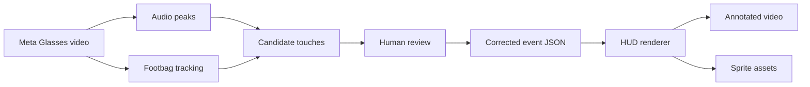

# Hacky Track

<p align="center">
  
</p>

<p align="center">
  <strong>POV footbag analytics for Meta Glasses footage.</strong><br>
  Track rallies, touches, stalls, trick labels, and sketchy little HUD overlays from first-person video.
</p>

---

## What This Is

Hacky Track is an experimental computer-vision and audio pipeline for turning first-person footbag footage into an annotated rally video.

The current demo renders a hand-drawn HUD over Meta Glasses footage with:

- live touch count
- rally timeline
- touch impact ticks near the footbag
- stall and around-the-world popups
- a move feed such as `RIGHT KICK`, `LEFT KICK`, `RIGHT STALL`, `AROUND THE WORLD`, `OUTER RIGHT`, and `OUTER LEFT`
- reusable MS Paint-style sprite assets

The goal is not just to count touches. The goal is to make the count explainable enough that a player can tell what the tracker thinks happened.

## Current Demo

The README GIF is generated from the latest HUD render:

```text
outputs/video-506_singular_display/video506_corrected_paint_hud_overlay.mp4
```

That source MP4 is intentionally ignored by Git because it is large. The lightweight README GIF lives at:

```text
assets/readme/hacky-track-demo.gif
```

For the current demo clip, the event timeline is manually corrected:

- 19 touches
- 1 right stall
- 1 around-the-world segment
- a hand-authored move feed for the top HUD

## Why It Is Hard

POV footbag tracking has a bunch of annoying edge cases:

- the bag is small, fast, and often motion-blurred
- camera motion is constant
- a foot, knee, hand, or grass patch can hide the bag
- audio spikes help, but floor bounces and footsteps can look like touches
- a rally reset is different from a kick
- a stall is different from a kick
- an around-the-world is a time window, not just one impact frame

So the MVP uses a practical workflow: detect candidates, review them, correct them, and render outputs that make mistakes obvious.

## Pipeline


```mermaid
flowchart LR
  A["Meta Glasses video"] --> B["Audio peaks"]
  A --> C["Footbag tracking"]
  B --> D["Candidate touches"]
  C --> D
  D --> E["Human review"]
  E --> F["Corrected event JSON"]
  F --> G["HUD renderer"]
  G --> H["Annotated video"]
  G --> I["Sprite assets"]
```

## Release-Candidate Touch + HUD Pipeline

The current release-candidate path uses fixed OWLv2 detections, L2 trajectory
features, audio features, and a learned touch classifier. The shipped touch
output is the merged event-level result, not raw cue candidates.

Refresh the touch pipeline status from the cached OWLv2 detections:

```bash
python3 run_touch_pipeline.py \
  --detections-jsonl runs/release-27-public/touch_corpus_v1/owlv2_touch_detections_v1/detections.jsonl \
  --detections-jsonl runs/release-27-public/touch_corpus_v1/owlv2_touch_detections_contact_missing_v1/detections.jsonl \
  --attach-audio-features
```

Run the v0.1 touch/HUD release readiness workflow in one command:

```bash
python3 hackytrack.py touch-release \
  --out-dir runs/release-27-public/touch_release_v0_1 \
  --touch-overrides release_overrides/touch_visual_overrides_v1.json
```

That command refreshes the touch pipeline, renders model-only and
visual-corrected HUDs, runs frozen-test analytics, checks contact/type readiness,
and writes `touch_release_readiness.md`.

Render release HUD videos from the merged classifier events:

```bash
python3 render_touch_release_hud.py
```

That writes HUD event docs, OWLv2/L2 touch-anchor files, reviewed stall/drop
label badges when available, MP4 overlays, contact sheets, and a preview sheet
under:

```text
runs/release-27-public/touch_corpus_v1/release_touch_hud_v1/
```

Render a visually corrected release HUD set by applying reviewed output-only
touch overrides:

```bash
python3 render_touch_release_hud.py \
  --out-dir runs/release-27-public/touch_corpus_v1/release_touch_hud_v8_contact_badges_frozen_corrected \
  --touch-overrides release_overrides/touch_visual_overrides_v1.json
```

The override file is a release rendering artifact, not classifier training data.
Reports should show both model-only and visually corrected HUD results.
When reviewed contact labels are available, this HUD path also shows them as
manual badges on matched touches. Those badges are explicit reviewed-label
facts, not automatic side/surface model predictions.

Audit rally stats and exact missed/fake touch times from a rendered HUD set:

```bash
python3 release_rally_analytics.py
```

Check whether side/contact-type classification has enough labels and pose
features to train:

```bash
python3 train_release_contact_classifier.py
```

Current v1.0 contact-intelligence status is intentionally split:

| signal | status |
| --- | --- |
| touch timing | release-candidate, merged event-level gates pass with the complete OWLv2 detection cache set |
| HUD touch sparks | release-candidate, OWLv2/L2 anchors, no HSV fallback |
| reviewed contact badges | manual/label-backed HUD display only |
| contact type | candidate, raw kick/stall accuracy passes but release-scope fails without enough stall/knee/drop labels |
| left/right side | candidate, below release gate |
| inner/outer surface | candidate, below release gate |
| automatic drop/floor reset | evaluated candidate, fails gate at 0.609 precision / 0.667 recall after full OWLv2/L2 coverage |
| automatic stall | not ready; only 3 approved stall examples in the existing reviewed reset/stall corpus |

The release-candidate report is:

```text
TOUCH_RELEASE_CANDIDATE_REPORT.md
```

The v1.0 rally-intelligence readiness report is:

```text
RELEASE_V1_0_READINESS_REPORT.md
```

The v0.1 release-readiness report is:

```text
RELEASE_V0_1_READINESS_REPORT.md
```

Current gate status: model-only merged-event touch timing passes leave-clips-out
CV (P/R/F1 0.925/0.896/0.910) and frozen test
(P/R/F1 0.979/0.986/0.982) when both OWLv2 detection caches are supplied.
Visual-corrected frozen HUD verification passes video, audio, nonblank-frame,
and badge-rendering checks.

## Main Scripts

| Script | Purpose |
| --- | --- |
| `hacky_mvp.py` | Original checked-event MVP: JSON, CSV, proof frames, annotated video. |
| `paint_hud.py` | Generates the reusable hand-drawn HUD sprite sheet and shared renderer helpers. |
| `render_video506_hud.py` | Current demo renderer for the corrected video-506 HUD. |
| `scan_training_data.py` | Scans raw clips into reviewable candidate touch data. |
| `train_multimodal_detector.py` | Trains/runs a weak visual/audio candidate detector. |
| `review_app.py` | Local web app for approving, rejecting, and adding touch candidates. |
| `prepare_review_evidence.py` | Builds grouped visual sheets for missed drops/touches, ball-center risk, side/contact uncertainty, stalls, and tricks. |
| `export_detector_dataset.py` | Exports reviewed footbag labels in a YOLO-compatible dataset layout plus hard-negative center crops. |
| `build_detector_false_positive_review_batch.py` | Mines trained-detector false positives into hard-negative/correction review sheets. |
| `footbag_detector_inference.py` | Runs a trained footbag detector or precomputed detections and writes a smoothed, auditable ball track. |
| `summarize_detector_batch.py` | Summarizes detector batch coverage, interpolation share, and per-video failure flags. |
| `run_touch_pipeline.py` | Runs the fixed-OWLv2 touch-classifier corpus pipeline and release gates. |
| `render_touch_release_hud.py` | Converts merged classifier touch events into HUD event docs and renders release HUD overlays. |
| `release_rally_analytics.py` | Summarizes rendered release rallies and reports exact false-positive/missed touch times against visual labels. |
| `release_event_error_audit.py` | Renders visual strips for remaining merged-event FP/FN cases with frames, ball-track graph, audio, and trajectory cues. |
| `train_touch_classifier.py` | Trains/evaluates the fused audio + trajectory touch classifier and writes merged event outputs. |
| `train_release_contact_classifier.py` | Separate readiness/eval gate for left/right/contact-type labels using pose proximity when labels/features exist. |
| `detect_atw_overlay.py` | Experimental footbag/foot heuristic for around-the-world detection. |

## Quickstart

Install dependencies:

```bash
python3 -m venv .venv
source .venv/bin/activate
pip install -r requirements.txt
```

Install `ffmpeg` if needed:

```bash
brew install ffmpeg
```

Optional detector training dependencies:

```bash
pip install -r requirements-detector.txt
```

Optional Moondream open-vocabulary detector spike:

```bash
pip install -r requirements-moondream.txt
export MOONDREAM_API_KEY=...
python3 oracle_detector_spike.py --model moondream --per-clip 0 --out-dir runs/release-27-public/oracle_moondream_v1
```

Moondream detect returns boxes without confidences, so the spike records a
synthetic score of `1.0` by default and uses the same dense-label scoring and QA
sheets as the OWLv2 run.

Process one video into a versioned release run directory:

```bash
python3 hackytrack.py process /path/to/video.MOV
```

That creates:

```text
runs/<timestamp>/
  summary.md
  run_manifest.json
  portable_paths_audit.json
  events.json
  events.csv
  rallies.json
  training/
  qa/
  review_batches/
  ball_tracking_audit/
  strict_rally_audit/
  validation/
  release_evaluation/
  hud/
```

Open the review UI for that run:

```bash
python3 hackytrack.py review --run-dir runs/<timestamp>
```

Seed the current review batch into run-local review files:

```bash
python3 hackytrack.py seed-reviews --run-dir runs/<timestamp>
```

Build grouped evidence sheets before or during review:

```bash
python3 hackytrack.py review-evidence --run-dir runs/<timestamp>
```

That writes `review_evidence/review_evidence_report.md` plus sheets grouped by
`gap_floor_reset`, `ball_accuracy`, `drop_review`, `side_contact`,
`stall_trick`, and `missed_touch`. The sheets show the QA ball center, detected
foot/limb point, and surrounding frames so missed drops and bad ball centers can
be reviewed without hand-editing JSON.

Apply an auditable decision file to the run-local reviews:

```bash
python3 hackytrack.py apply-decisions \
  --run-dir runs/<timestamp> \
  --decisions runs/<timestamp>/reviews/codex_visual_review_decisions.json
```

Verify a rendered HUD MP4:

```bash
python3 hackytrack.py verify --run-dir runs/<timestamp>
```

Recompute release metrics after review decisions change:

```bash
python3 hackytrack.py evaluate --run-dir runs/<timestamp>
```

Export reviewed labels for a trained footbag detector:

```bash
python3 hackytrack.py export-detector-dataset --run-dir runs/<timestamp>
```

That writes `detector_dataset/data.yaml`, `images/<split>/`,
`labels/<split>/`, `reviewed_detector_labels.jsonl`, and
`hard_negatives/points.jsonl`. Rejected touch events are not automatically
treated as "not ball": a hand-held bag remains a positive `footbag` object,
while a marker on a leg, grass, or another non-bag patch becomes a hard-negative
center crop.

Build a detector-label review batch when the trained detector needs more clean
examples:

```bash
python3 hackytrack.py detector-label-review \
  --run-dir runs/<timestamp> \
  --out-dir runs/<timestamp>/detector_label_review
```

That mines QA ball centers into `detector_label_review_manifest.json`,
`detector_label_review_items.jsonl`, preview crops, a contact sheet, and a
`detector_label_decisions_template.json`. These are pending object-label
reviews, not training labels yet; approve/correct them before exporting a larger
reviewed detector dataset. Once decisions are filled, include them during export:

```bash
python3 hackytrack.py export-detector-dataset \
  --run-dir runs/<timestamp> \
  --detector-label-review-manifest runs/<timestamp>/detector_label_review/detector_label_review_manifest.json \
  --detector-label-decisions runs/<timestamp>/detector_label_review/detector_label_decisions.json
```

For a conservative first pass, generate CV-assisted suggestions and keep
ambiguous rows pending:

```bash
python3 hackytrack.py assist-detector-labels \
  --review-manifest runs/<timestamp>/detector_label_review/detector_label_review_manifest.json \
  --out runs/<timestamp>/detector_label_review/detector_label_assisted_decisions.json
```

Assisted decisions are useful for experiments, but they are not a substitute for
final reviewed labels.

Mine detector false positives when a checkpoint marks grass, hands, shadows, or
other non-bag regions:

```bash
python3 hackytrack.py detector-false-positive-review \
  --run-dir runs/<timestamp> \
  --inference-root runs/<timestamp>/detector_inference \
  --out-dir runs/<timestamp>/detector_false_positive_review
```

That writes the same review-manifest/decision-template shape as
`detector-label-review`, but defaults each row to a `verify_or_correct` suggestion.
Rows are still review items: if the model found a real bag between sparse QA
touch labels, mark it `footbag` or `corrected`; if the marked center is truly
not the bag, keep it `not_footbag`.

Build a detector-error review batch after a completed model/track evaluation to
recover missed labels and inspect high-error centers:

```bash
python3 hackytrack.py detector-error-review \
  --qa-manifest runs/<timestamp>/qa_manifest.json \
  --track-metrics runs/<timestamp>/detector_track_evaluation/detector_track_metrics.json \
  --dataset runs/<timestamp>/detector_dataset \
  --model-metrics runs/<timestamp>/detector_model_evaluation/detector_model_metrics.json \
  --out-dir runs/<timestamp>/detector_error_review
```

That writes `detector_error_review_manifest.json`, JSONL review items, a
decision template, crops, and a contact sheet with expected label centers and
model/track centers overlaid. Held-out test split rows are marked `audit_only`
so they can diagnose failures without leaking into the next training export.

Build dense frame-level trajectory review clips when sparse detector labels are
no longer enough:

```bash
python3 hackytrack.py dense-trajectory-review \
  --qa-manifest runs/<timestamp>/qa_manifest.json \
  --track-metrics runs/<timestamp>/detector_track_evaluation/detector_track_metrics.json \
  --batch-summary runs/<timestamp>/detector_batch_summary/detector_batch_summary.json \
  --dataset runs/<timestamp>/detector_dataset \
  --out-dir runs/<timestamp>/dense_trajectory_review
```

That writes `dense_trajectory_review_manifest.json`, a
`dense_trajectory_schema.json`, per-clip frame exports/contact sheets, and a
combined `dense_trajectory_labels_template.jsonl`. Rows use explicit visibility
states (`visible`, `partially_occluded`, `fully_occluded`, `out_of_frame`,
`uncertain`, `unlabeled`) and `training_use`; held-out test clips stay
`audit_only`.

Evaluate reviewed dense trajectory labels against predictions or detector-track
exports:

```bash
python3 hackytrack.py evaluate-dense-trajectory \
  --labels-jsonl runs/<timestamp>/dense_trajectory_review/dense_trajectory_labels_reviewed.jsonl \
  --tracks-root runs/<timestamp>/detector_inference \
  --out-dir runs/<timestamp>/dense_trajectory_evaluation
```

This dense evaluation is the intended gate for a future temporal heatmap tracker.
Sparse detector event-label metrics remain useful, but they do not prove
continuous bag tracking by themselves.

Multiple detector review sets can be combined during export:

```bash
python3 hackytrack.py export-detector-dataset \
  --run-dir runs/<timestamp> \
  --detector-label-review-manifest runs/<timestamp>/detector_label_review/detector_label_review_manifest.json \
  --detector-label-decisions runs/<timestamp>/detector_label_review/detector_label_decisions.json \
  --detector-label-review-pair runs/<timestamp>/detector_false_positive_review/detector_false_positive_review_manifest.json:runs/<timestamp>/detector_false_positive_review/detector_false_positive_decisions.json
```

Train the detector once enough reviewed labels exist:

```bash
python3 hackytrack.py train-detector \
  --run-dir runs/<timestamp> \
  --base-model yolo11n.pt \
  --epochs 80
```

Training writes `detector_models/training_manifest.json` and, when Ultralytics
finishes successfully, `detector_models/footbag_detector_best.pt`. The manifest
records the Ultralytics results directory, `results.csv`, final metrics, and
best-epoch metrics by mAP50. The current reviewed dataset is
intentionally still small; this command is the release path, not yet a claim
that the trained detector has met the held-out targets.

If Ultralytics writes weights but the wrapper is interrupted before the public
manifest is copied, recover the versioned artifact without retraining:

```bash
python3 hackytrack.py train-detector \
  --run-dir runs/<timestamp> \
  --run-name footbag-detector \
  --recover-existing
```

Before using a trained checkpoint on videos, run the model-level sanity gate on
the exported detector dataset:

```bash
python3 hackytrack.py evaluate-detector-model \
  --run-dir runs/<timestamp> \
  --model runs/<timestamp>/detector_models/footbag_detector_best.pt
```

That writes `detector_model_evaluation/detector_model_metrics.json`, `.csv`,
and `.md`. A checkpoint must pass this gate at release confidence before it is
promoted into rally analytics or HUD selection; low-confidence near-label
matches are useful training diagnostics, not release-quality detections.
The metrics JSON also includes a threshold sweep and a validation-split
`threshold_recommendation`, gated by hard-negative false positives. Use that
artifact directly during inference instead of copying threshold numbers by hand:

```bash
python3 hackytrack.py detect-footbag \
  --video /path/to/video.MOV \
  --model runs/<timestamp>/detector_models/footbag_detector_best.pt \
  --calibration-metrics runs/<timestamp>/detector_model_evaluation/detector_model_metrics.json \
  --out-dir runs/<timestamp>/detector_inference/<video-stem>
```

After batch inference, summarize detector coverage before promoting tracks into
QA analytics:

```bash
python3 hackytrack.py summarize-detector-batch \
  --tracks-root runs/<timestamp>/detector_inference \
  --out-dir runs/<timestamp>/detector_batch_summary
```

This writes JSON, CSV, and Markdown with per-video raw detections, track
coverage, model-detection coverage, interpolation share, and flags for clips
that need more review labels.

For tiny footbag objects, the release branch also includes a trained patch
objectness stage. It scores reviewed crop proposals rather than asking YOLO to
find a very small object in the full portrait frame:

```bash
python3 hackytrack.py train-patch-detector \
  --run-dir runs/<timestamp>

python3 hackytrack.py evaluate-patch-detector \
  --run-dir runs/<timestamp>
```

For a non-linear baseline after adding hard negatives:

```bash
python3 hackytrack.py train-patch-detector \
  --run-dir runs/<timestamp> \
  --model-kind extra-trees
```

This writes `patch_detector/patch_training_manifest.json`,
`patch_detector/patch_footbag_detector.joblib`, and
`patch_detector_evaluation/patch_detector_metrics.json`. Candidate proposals
are still auditable CV evidence; the trained patch model is the gate deciding
whether those proposals look like the reviewed footbag. Reviewed false-positive
points in `detector_dataset/hard_negatives/points.jsonl` are used as centered
negative samples during patch training, so a reviewed bad marker on a shoe,
hand, grass, or shadow feeds directly back into the model.

Patch and detector inference should use the same coordinate space as QA labels:

```bash
python3 hackytrack.py detect-footbag \
  --video /path/to/video.MOV \
  --patch-model runs/<timestamp>/patch_detector/patch_footbag_detector.joblib \
  --process-width 688 \
  --process-height 912
```

The resulting `detector_inference_manifest.json` records both the original
video size and the processed-frame size so downstream QA comparison is not
silently mixing coordinate systems.

Run detector-backed ball tracking on a video:

```bash
python3 hackytrack.py detect-footbag \
  --run-dir runs/<timestamp> \
  --video /path/to/video.MOV
```

That writes `detector_inference/<video>/detector_track.json`,
`detector_track.csv`, and `detector_inference_manifest.json`. Each track point
keeps its confidence and uncertainty reasons. The same command can also consume
precomputed model detections for reviewable/offline tests:

```bash
python3 hackytrack.py detect-footbag \
  --detections-jsonl detections.jsonl \
  --out-dir detector_inference/debug \
  --fps 30
```

Run detector-backed ball tracking for every video in a run or QA manifest:

```bash
python3 hackytrack.py detect-footbag-batch \
  --run-dir runs/<timestamp> \
  --video-root /path/to/source/videos
```

That writes one `detector_inference/<video-stem>/` directory per video plus
`detector_inference/detector_batch_manifest.json`. For offline/model-fixture
testing, provide `--detections-root` containing `<video-stem>.jsonl` files.

Attach detector-track evidence back onto QA events:

```bash
python3 hackytrack.py apply-detector-track --run-dir runs/<timestamp>
```

That writes `qa_model_track/qa_manifest.json` and per-video `qa_events.json`
files with `model_ball_*` fields on each event. By default it does not replace
the old heuristic `qa_ball_*` center; add `--promote-model` only after the model
has passed validation, and mismatched model/heuristic centers stay flagged for
review instead of being silently promoted.

Evaluate detector tracks against reviewed labels:

```bash
python3 hackytrack.py evaluate-detector --run-dir runs/<timestamp>
```

That writes `detector_evaluation/detector_track_metrics.json`, `.csv`, and
`.md`, including split-level center pass rates and hard-negative false-positive
checks. This is the gate that must pass before model centers should replace the
heuristic ball evidence.

Apply reviewed approve/reject/missing decisions back into QA analytics:

```bash
python3 hackytrack.py apply-reviews --run-dir runs/<timestamp>
```

That writes a reviewed QA manifest under `qa_reviewed/` and a fresh strict
rally audit under `strict_rally_audit_reviewed/`. Use this after approving
missing floor-reset proposals so rally segmentation and HUD eligibility reflect
the review decisions.

Write a release-candidate gate report:

```bash
python3 hackytrack.py report --run-dir runs/<timestamp> --tests-passed
```

The report lists artifact paths, metric gates, strict-rally eligibility, HUD
verification status, and remaining limitations. Use artifact override flags like
`--qa-manifest`, `--strict-rally-audit`, or `--qa-reviewed-manifest` when
auditing a corrected/reviewed manifest that lives outside the default run
layout.

The public run manifest and release text artifacts are sanitized at the end of
`process`; `portable_paths_audit.json` should report no hardcoded `/Users/...`
paths.

If a clip has no strict-complete rally yet, analytics still complete and the run writes `hud/hud_error.json`. The strict rally audit explains why candidate rallies were rejected:

```text
runs/<timestamp>/strict_rally_audit/strict_rally_audit.md
```

To render the best available rally anyway:

```bash
python3 hackytrack.py process /path/to/video.MOV --allow-incomplete-hud
```

For the current reviewed dataset, you can point validation at the existing reviewed labels:

```bash
python3 hackytrack.py process /path/to/*.MOV --reviews-dir reviews
```

Evaluate the existing 27-video review batch without reprocessing videos:

```bash
python3 release_evaluation.py \
  --reviews-dir reviews \
  --batch outputs/review_batches/latest_review_batch.json \
  --training-manifest outputs/full_training_27/full_training_manifest.json \
  --model-dir models/full_training_27 \
  --ball-audit outputs/ball_tracking_audit/audit_metrics.json \
  --out-dir outputs/release_evaluation_27
```

Render the legacy manually corrected demo HUD:

```bash
python3 render_video506_hud.py /path/to/video-506_singular_display.MOV --scale 0.5
```

Generate the README GIF from the rendered MP4:

```bash
ffmpeg -hide_banner -loglevel error -y \
  -i outputs/video-506_singular_display/video506_corrected_paint_hud_overlay.mp4 \
  -filter_complex "[0:v]fps=7,scale=320:-1:flags=lanczos,split[s0][s1];[s0]palettegen=max_colors=64:reserve_transparent=0[p];[s1][p]paletteuse=dither=bayer:bayer_scale=5" \
  -loop 0 assets/readme/hacky-track-demo.gif
```

Run the review app:

```bash
python3 review_app.py \
  --qa-manifest runs/<timestamp>/qa/qa_manifest.json \
  --review-batch runs/<timestamp>/review_batches/latest_review_batch.json \
  --assisted-review runs/<timestamp>/review_batches/assisted_review_suggestions.json \
  --reviews-dir runs/<timestamp>/reviews
```

Then open:

```text
http://127.0.0.1:8765/
```

Review batches include two sources:

- `candidate`: detector events that need approve/reject/correction.
- `active_learning`: suppressed or uncertain events that may be missing touches, drops, stalls, floor resets, or tricks.

In the review app, use the `Batch` filter and search for tags like
`active_learning`, `likely_missed_touch`, `likely_missed_drop_floor`,
`likely_missing_floor_reset`, `gap_without_floor_reset`,
`strict_best_rally_blocker`, `likely_missed_stall`, or
`likely_missed_around_the_world`. Approving an active-learning item records it
as a missing event, so recall metrics change after validation/evaluation is
rerun.

For faster review triage, build the evidence pack from the public CLI:

```bash
python3 hackytrack.py review-evidence --run-dir runs/<timestamp>
```

Use `review_evidence/review_evidence_report.md` to work through the highest
priority blockers first. Gap sheets are the first stop for dropped-rally
selection bugs; ball-accuracy sheets expose cases where the QA marker is not on
the visible bag; side/contact sheets isolate left/right, knee, and ambiguous
contact decisions.

For traceable bulk review, seed the batch and apply a decision file:

```bash
python3 hackytrack.py seed-reviews --run-dir runs/<timestamp>
python3 hackytrack.py apply-decisions --run-dir runs/<timestamp>
python3 hackytrack.py apply-reviews --run-dir runs/<timestamp>
python3 hackytrack.py evaluate --run-dir runs/<timestamp>
```

The decision file format is a JSON object with `decisions`, where each decision
names `review_stem`, `item_id`, `status`, optional corrected labels like
`contact_side`, `contact_type`, `start_sec`, `end_sec`, `x`, `y`, and a short
`evidence` note. Pending or uncertain events should stay pending.

## Sprite Sheet

The HUD style comes from generated transparent PNG assets under:

```text
assets/ms_paint_hud/
```

This includes:

- counter panels
- digit sprites
- move labels
- pips
- stall badges
- around-the-world badges
- custom star/tick effects

The roughness is intentional. The target style is playful, hand-drawn, and a little broken in a good way.

## Data Model

Checked events are stored as JSON under `data/`. A rally event can include:

- `touch`
- `stall`
- `drop_floor`
- special event windows such as `around_the_world`

The current demo uses:

```text
data/video-506_singular_display.events.json
```

That file is the source of truth for the corrected render.

## Status

This is moving from MVP toward a release candidate. The current release goal is tracked in:

```text
RELEASE_GOAL.md
```

What works:

- auditable event timelines
- HUD rendering
- reusable sprite assets
- local review workflow
- full 27-video QA and validation loop
- a public `hackytrack.py` CLI that writes versioned run directories
- clean release evaluation with train/validation/test splits separated from exploratory review labels

What is still in progress:

- robust automatic footbag tracking across new users' clips
- broader automatic touch robustness; event-level timing passes aggregate gates,
  but `video-344_singular_display-2` remains the weakest leave-clips-out clip
- reliable side/contact-type/knee classification; pose/body-proximity and
  visual-crop features are attachable now, and the release contact classifier
  trains, but side and inner/outer surface accuracy are still below gate
- automatic stall/drop detection; release HUD can render reviewed stall/drop
  labels, and the separate reset/stall audit now has full OWLv2/L2 coverage,
  but automatic drop still fails gate and stall remains label-limited
- higher-recall trick detection
- active learning for likely missed events
- fresh-clone release testing on more machines

Current v1.0 rally-intelligence status is tracked in:

```text
RELEASE_V1_0_READINESS_REPORT.md
```

## Direction

The next release milestone is a better model loop:

1. Gather more Meta Glasses clips.
2. Track the footbag frame by frame.
3. Use audio only as supporting evidence, not the whole detector.
4. Review and correct candidates quickly.
5. Train from approved/rejected touches.
6. Report clean train/validation/test metrics.
7. Render the HUD from structured, explainable events.

The end state is a lightweight POV sports HUD for footbag: count the rally, identify the trick, show the proof, and keep the edit fun.
